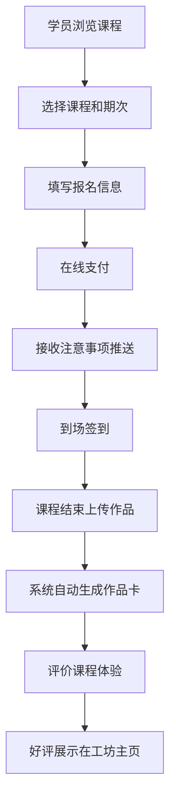

## 1. 产品概述

手工课程与DIY工坊预约平台，连接手工工坊与创意爱好者，提供陶艺、皮具、花艺、蜡烛等多种手工课程的在线预约、支付、签到、作品分享全流程服务。

- 解决工坊课程管理效率低、学员报名流程繁琐的痛点，为企业团建提供专属定制服务
- 目标用户：手工工坊经营者、DIY爱好者、企业HR/行政人员
- 市场价值：打造手工爱好者社群，提升工坊运营效率，拓展企业团建新渠道

## 2. 核心 Features

### 2.1 用户角色

| 角色 | 注册方式 | 核心权限 |
|------|---------|----------|
| 工坊管理员 | 手机号/邮箱注册 | 发布课程、管理期次、签到管理、查看评价、设置系列课程、配置团建专场 |
| 普通学员 | 手机号/微信注册 | 浏览课程、在线报名付款、上传作品、评价课程、分享作品卡 |
| 企业用户 | 企业认证注册 | 预订团建专场、配置专属材料包、查看参与人员签到 |

### 2.2 功能模块

1. **首页**：精选课程推荐、工坊展示、好评墙、分类导航
2. **课程列表**：课程筛选、分类浏览、搜索功能
3. **课程详情**：课程介绍、期次选择、报名付款、注意事项推送
4. **工坊主页**：工坊介绍、全部课程、学员评价、作品展示
5. **学员中心**：我的报名、我的作品、我的评价、作品卡分享
6. **工坊管理后台**：课程管理、期次管理、签到管理、评价管理、系列课程设置、团建专场管理
7. **作品卡生成**：自动生成精美作品卡、支持社交平台分享
8. **企业团建**：专场预订、人数配置、专属材料包设置

### 2.3 页面详情

| 页面名称 | 模块名称 | 功能描述 |
|---------|---------|----------|
| 首页 | Hero区 | 平台标语、搜索框、热门分类入口、轮播推荐 |
| 首页 | 精选课程 | 卡片式展示热门课程，显示价格、时长、评分 |
| 首页 | 好评墙 | 瀑布流展示学员真实评价和作品照片 |
| 首页 | 分类导航 | 陶艺/皮具/花艺/蜡烛等分类快捷入口 |
| 课程列表页 | 筛选区 | 按分类、价格、时长、年龄段筛选 |
| 课程列表页 | 课程卡片 | 展示课程封面、名称、工坊、价格、评分、剩余名额 |
| 课程详情页 | 课程信息 | 图文介绍、时长、人数限制、材料费说明、适合年龄 |
| 课程详情页 | 期次选择 | 日历形式展示可报名期次，显示剩余名额 |
| 课程详情页 | 报名付款 | 选择人数、在线支付、优惠券使用 |
| 课程详情页 | 注意事项 | 报名成功后推送穿着建议、工具携带说明 |
| 工坊主页 | 工坊介绍 | 品牌故事、环境照片、联系方式 |
| 工坊主页 | 课程列表 | 该工坊所有课程展示 |
| 工坊主页 | 评价展示 | 学员评分和评价内容 |
| 学员中心 | 我的报名 | 已报名课程列表、签到二维码、课程状态 |
| 学员中心 | 我的作品 | 上传作品照片、生成作品卡、查看历史作品 |
| 学员中心 | 作品卡分享 | 一键生成带滤镜和边框的精美作品卡，支持下载分享 |
| 学员中心 | 我的评价 | 待评价课程、已发表评价 |
| 工坊管理后台 | 课程管理 | 发布/编辑/下架课程，设置课程参数 |
| 工坊管理后台 | 期次管理 | 添加课程期次，设置时间、人数限制、费用 |
| 工坊管理后台 | 签到管理 | 查看报名名单、扫码/手动签到 |
| 工坊管理后台 | 系列课程 | 创建系列课程包，设置优惠价格 |
| 工坊管理后台 | 团建专场 | 接收企业预订、配置专属材料包 |

## 3. 核心流程

### 3.1 学员报名流程
学员浏览课程 → 选择期次 → 填写报名信息 → 在线支付 → 接收注意事项通知 → 到场签到 → 课程结束上传作品 → 生成作品卡 → 评价课程

### 3.2 工坊管理流程
工坊注册认证 → 发布课程信息 → 设置课程期次 → 接收学员报名 → 管理签到 → 查看作品和评价 → 回复评价

### 3.3 企业团建流程
企业用户选择课程 → 预订专场 → 填写参与人数和日期 → 支付费用 → 工坊配置专属材料包 → 活动当天签到 → 收集作品

## 4. 用户界面设计

### 4.1 设计风格
- **整体风格**：温暖自然、手工质感、文艺清新
- **主色调**：陶土橙 #D97757、米杏色 #F5EFE6、森林绿 #5B8A72
- **辅助色**：陶艺棕 #8B6F47、花艺粉 #E8B4B8、蜡烛金 #D4A574
- **按钮风格**：圆润边角（12px）、微立体阴影、hover时轻微上浮效果
- **字体**：标题用「思源宋体」展现文艺气质，正文用「思源黑体」保证可读性
- **布局风格**：卡片式布局、柔和阴影、大量留白、自然纹理背景
- **图标风格**：手绘线条风格图标，贴合手工主题

### 4.2 页面设计概述

| 页面名称 | 模块名称 | UI 元素 |
|---------|---------|----------|
| 首页 | Hero区 | 大标题、柔和渐变背景、搜索框、分类图标按钮 |
| 首页 | 精选课程 | 卡片网格布局、课程封面图、标签（陶艺/皮具等）、评分星星 |
| 首页 | 好评墙 | 瀑布流布局、学员头像、作品照片、评价文字 |
| 课程详情页 | 课程信息 | 轮播图、标签、价格、时长、人数、适合年龄图标 |
| 课程详情页 | 期次选择 | 日历组件、可选择日期高亮、剩余名额提示 |
| 作品卡生成 | 作品展示 | 多种边框模板、滤镜效果、课程信息水印、分享按钮 |
| 工坊主页 | 头部 | 封面大图、工坊Logo、评分、关注按钮 |
| 工坊管理后台 | 侧边栏 | 图标+文字导航、选中状态高亮 |

### 4.3 响应式设计
- 采用桌面优先设计，适配1200px以上屏幕
- 平板端（768-1199px）：两列布局，导航折叠
- 移动端（<768px）：单列布局，底部Tab导航，触摸优化
- 所有交互元素最小尺寸44x44px，适合触屏操作

### 4.4 动效设计
- 页面加载：元素淡入+上移的级联动画
- 卡片hover：轻微上浮（translateY -4px）+ 阴影加深
- 按钮点击：缩放效果（scale 0.98）
- 作品卡生成：边框和滤镜平滑过渡动画
- 滚动：导航栏背景色渐变过渡
