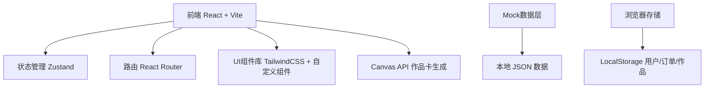
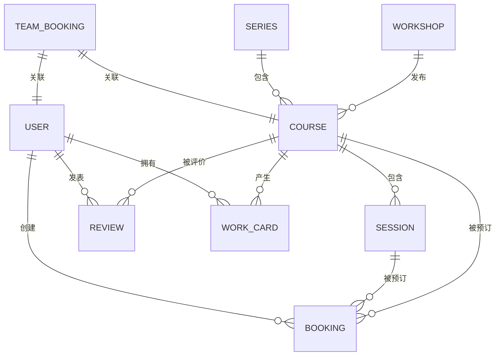

## 1. 架构设计



## 2. 技术描述

- **前端框架**: React@18.2.0 + TypeScript
- **构建工具**: Vite@5.0.0
- **路由管理**: React Router DOM@6.20.0
- **状态管理**: Zustand@4.4.7
- **样式方案**: TailwindCSS@3.3.6 + PostCSS + Autoprefixer
- **图标库**: Lucide React@0.294.0
- **HTTP客户端**: Axios@1.6.2（预留）
- **数据持久化**: LocalStorage + Mock数据
- **Canvas操作**: 原生Canvas API（作品卡生成）
- **表单处理**: React Hook Form@7.48.2
- **日期处理**: date-fns@2.30.0

## 3. 路由定义

| 路由路径 | 页面用途 |
|---------|----------|
| `/` | 首页 - 精选课程、分类导航、好评墙 |
| `/courses` | 课程列表页 - 筛选、搜索、课程卡片 |
| `/courses/:id` | 课程详情页 - 课程信息、期次选择、报名 |
| `/workshops/:id` | 工坊主页 - 工坊介绍、课程列表、评价 |
| `/user` | 学员中心 - 我的报名、作品、评价 |
| `/user/bookings` | 我的报名 - 报名记录、签到 |
| `/user/works` | 我的作品 - 作品上传、作品卡生成 |
| `/user/reviews` | 我的评价 - 待评价、已评价 |
| `/admin` | 工坊管理后台首页 |
| `/admin/courses` | 课程管理 - 发布/编辑课程 |
| `/admin/sessions` | 期次管理 - 添加/管理课程期次 |
| `/admin/checkin` | 签到管理 - 学员签到 |
| `/admin/series` | 系列课程管理 |
| `/admin/team` | 团建专场管理 |
| `/team-booking` | 企业团建预订页 |
| `/login` | 登录页 |
| `/register` | 注册页 |

## 4. 数据模型

### 4.1 实体关系图



### 4.2 数据类型定义

```typescript
// 工坊
interface Workshop {
  id: string;
  name: string;
  description: string;
  coverImage: string;
  gallery: string[];
  address: string;
  phone: string;
  rating: number;
  reviewCount: number;
  createdAt: string;
}

// 课程分类
type CourseCategory = 'pottery' | 'leather' | 'floral' | 'candle' | 'other';

// 课程
interface Course {
  id: string;
  workshopId: string;
  workshopName: string;
  title: string;
  category: CourseCategory;
  description: string;
  images: string[];
  duration: number; // 分钟
  maxPeople: number;
  price: number;
  materialIncluded: boolean;
  materialFee?: number;
  ageRange: { min: number; max: number };
  difficulty: 'beginner' | 'intermediate' | 'advanced';
  rating: number;
  reviewCount: number;
  isSeries: boolean;
  seriesId?: string;
  notice: string[]; // 注意事项
  createdAt: string;
}

// 课程期次
interface Session {
  id: string;
  courseId: string;
  date: string;
  startTime: string;
  endTime: string;
  maxPeople: number;
  currentPeople: number;
  price: number;
  isTeamBooking: boolean;
  teamBookingId?: string;
}

// 系列课程
interface Series {
  id: string;
  workshopId: string;
  name: string;
  description: string;
  courseIds: string[];
  originalPrice: number;
  discountPrice: number;
  coverImage: string;
}

// 用户
interface User {
  id: string;
  phone: string;
  nickname: string;
  avatar: string;
  role: 'student' | 'workshop' | 'enterprise';
  workshopId?: string;
  enterpriseName?: string;
}

// 报名订单
interface Booking {
  id: string;
  userId: string;
  courseId: string;
  sessionId: string;
  peopleCount: number;
  totalPrice: number;
  status: 'pending' | 'paid' | 'checkedin' | 'completed' | 'cancelled';
  paidAt?: string;
  checkedInAt?: string;
  createdAt: string;
  attendeeNames: string[];
}

// 作品卡
interface WorkCard {
  id: string;
  userId: string;
  courseId: string;
  bookingId: string;
  originalImage: string;
  filteredImage?: string;
  borderStyle: string;
  filterStyle: string;
  courseName: string;
  workshopName: string;
  createdAt: string;
  isPublic: boolean;
}

// 评价
interface Review {
  id: string;
  userId: string;
  userName: string;
  userAvatar: string;
  courseId: string;
  workshopId: string;
  rating: number;
  content: string;
  images: string[];
  workCardIds: string[];
  createdAt: string;
  isFeatured: boolean; // 是否精选展示
}

// 企业团建预订
interface TeamBooking {
  id: string;
  userId: string;
  enterpriseName: string;
  courseId: string;
  sessionId: string;
  peopleCount: number;
  totalPrice: number;
  status: 'pending' | 'paid' | 'confirmed' | 'completed';
  requirements: string;
  materialPackageConfig: MaterialPackageItem[];
  createdAt: string;
}

interface MaterialPackageItem {
  name: string;
  quantity: number;
  description: string;
}
```

### 4.3 Mock数据结构

项目将在 `src/data/mock/` 目录下创建以下模拟数据文件：
- `workshops.json` - 工坊数据（3个）
- `courses.json` - 课程数据（12个，覆盖4个分类）
- `sessions.json` - 课程期次数据（每个课程3-5个期次）
- `users.json` - 用户数据
- `bookings.json` - 报名订单数据
- `reviews.json` - 评价数据
- `workCards.json` - 作品卡数据
- `series.json` - 系列课程数据

## 5. 核心组件结构

```
src/
├── components/
│   ├── layout/
│   │   ├── Header.tsx          # 顶部导航
│   │   ├── Footer.tsx          # 底部信息
│   │   ├── AdminSidebar.tsx    # 后台侧边栏
│   │   └── MobileNav.tsx       # 移动端底部导航
│   ├── home/
│   │   ├── HeroBanner.tsx      # 首页Hero区
│   │   ├── CategoryNav.tsx     # 分类导航
│   │   ├── CourseCard.tsx      # 课程卡片
│   │   └── ReviewWall.tsx      # 好评墙
│   ├── course/
│   │   ├── SessionCalendar.tsx # 期次日历
│   │   ├── BookingModal.tsx    # 报名弹窗
│   │   ├── NoticePanel.tsx     # 注意事项面板
│   │   └── ReviewList.tsx      # 评价列表
│   ├── workcard/
│   │   ├── WorkCardEditor.tsx  # 作品卡编辑器
│   │   ├── FilterSelector.tsx  # 滤镜选择器
│   │   └── BorderSelector.tsx  # 边框选择器
│   ├── admin/
│   │   ├── CourseForm.tsx      # 课程表单
│   │   ├── SessionForm.tsx     # 期次表单
│   │   ├── CheckinTable.tsx    # 签到表格
│   │   └── SeriesForm.tsx      # 系列课程表单
│   └── common/
│       ├── Button.tsx          # 通用按钮
│       ├── Card.tsx            # 通用卡片
│       ├── Modal.tsx           # 弹窗
│       ├── Rating.tsx          # 评分组件
│       └── EmptyState.tsx      # 空状态
├── pages/
│   ├── Home.tsx
│   ├── CourseList.tsx
│   ├── CourseDetail.tsx
│   ├── WorkshopDetail.tsx
│   ├── UserCenter.tsx
│   ├── UserBookings.tsx
│   ├── UserWorks.tsx
│   ├── AdminDashboard.tsx
│   ├── AdminCourses.tsx
│   ├── AdminSessions.tsx
│   ├── AdminCheckin.tsx
│   ├── TeamBooking.tsx
│   ├── Login.tsx
│   └── Register.tsx
├── store/
│   ├── useUserStore.ts         # 用户状态
│   ├── useCartStore.ts         # 购物车/报名状态
│   └── useWorkCardStore.ts     # 作品卡编辑状态
├── data/
│   └── mock/                   # Mock数据
├── types/                      # TypeScript类型定义
├── utils/                      # 工具函数
├── hooks/                      # 自定义Hooks
└── styles/                     # 全局样式
```

## 6. 核心功能技术实现

### 6.1 作品卡生成
- 使用 HTML5 Canvas API 实现图片滤镜和边框
- 支持多种预设滤镜（复古、胶片、日系、黑白等）
- 提供多种手工风格边框模板
- 自动添加课程名称、工坊名称水印
- 支持导出为PNG格式下载

### 6.2 日历期次选择
- 基于 date-fns 实现自定义日历组件
- 显示可预约日期、剩余名额、价格
- 支持已约满、过期日期的状态展示
- 点击日期展示当天所有时段

### 6.3 签到管理
- 为每个报名生成唯一签到二维码（纯前端模拟）
- 支持扫码签到和手动签到两种方式
- 实时更新签到状态和人数统计

### 6.4 响应式布局
- 使用 TailwindCSS 的响应式断点
- 桌面端1200px+：4列网格
- 平板端768-1199px：2列网格
- 移动端<768px：单列布局 + 底部Tab导航
